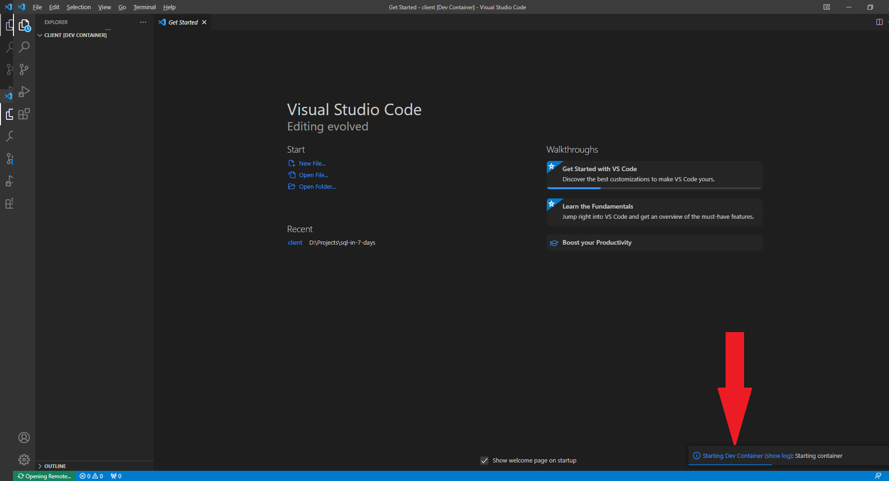

# SQL in 7 Days

Capsulated knowledge on SQL for Data Professionals

This is the repository for [SQL in 7 Days
](https://bpbonline.com/products/sql-in-7-days),published by BPB Publications. 

Here you will find SQL queries and code snippers used in the book, as well as the instructions on how to set up lab databases to work with these queries and code snippets.

# Databases

The code used in the book is designed to work with two databases running on an instance of PostgreSQL 13.

The first database is called **basic**. It's used for the code and queries in chapters 1 through 3.

The second database is called **advanced**. It's used for the code and queries chapters 4 through 10.

The instance and the databases are designed to be run in a Docker container.

## Installing the databases

To use these databases, you will have to install Docker on your machine. Go to https://docs.docker.com/get-docker/ and follow the instructions for your operating system.

Once you are done installing Docker, download this code to your machine. On GitHub, click _Code / Download Zip_. It will download a zip archive with the code. Unzip this archive into a directory on your computer. Remember its path, you will need it on the following step.

Open your console application (on Windows, it's `cmd.exe`) and change the working directory to the one you have downloaded the code into. Replace `<Download Path>` with the full path to the directory where you have downloaded and unzipped the code.

```bash
cd /d <Download Path>
```

Then run the following commands. You can just copy them and paste into the console application:

```bash
docker build -t sql-in-7-days-database .
docker network create sql-in-7-days
docker run -d -p 127.0.0.1:5432:5432 --name sql-in-7-days-database --network=sql-in-7-days sql-in-7-days-database

```

You can check that the database system is operative by running this command:

```bash
docker container ls

```

and making sure it outputs a string similar to this:

```
1234567890ab   sql-in-7-days-database    "docker-entrypoint.s…"   3 minutes ago   Up 4 minutes   127.0.0.1:5432->5432/tcp   sql-in-7-days-database
```

## Connecting to the server

To connect to the database server and run queries, you will need to download and install pgAdmin4, a free tool to work with PostgreSQL databases.

Go to https://www.pgadmin.org/download/ and download the version for your operating system.

Once you are done installing pgAdmin4, run it and make the following steps:

1. Right-click on Servers on the left hand side menu, select _Create / Server_:

   

1. On the General tab, insert the value `sql-in-7-days` into the field _Name_:

   

1. On the Connection tab, insert the following values:

   1. Host name/address: `127.0.0.1`
   1. Username: `elsie`
   1. Password: `elsie`
   1. Save password?: `Yes`

   Leave all the other values as is and click Save

   

1. Expand the server connection you have just created. You should see three databases, named **advanced**, **basic**, and **postgres**. If you see them, everything works fine.

   

1. To run a query against a database:

   1. Select the database in the left hand side menu. Chapters 1 to 3 in the book use the database **basic**; chapters 4 to 10 use the database **advanced**.
   2. In the main menu, select Tools / Query Tool

      

   3. Paste the query text into the Query Editor window on the right hand side
   4. Click Execute/Refresh button (or click F5 on the keyboard)

      

1. All the queries which are mentioned in the book are stored in the folder **queries** in the directory with the code. The queries are numbered in the book, file names correspond to the query numbers.

1. When running queries, make sure you're running them against the right database. Remember, queries mentioned in the Chapters 1 to 3 (that is, queries from 1 to 68) use the database **basic**. The rest of the queries (queries from 69 to 161) use the database **advanced**.

The results of all the queries should be the same as in the book. However, some of the queries, which deal with the DML, can change the database. In this case, the results of the queries will not match the book anymore. This is normal.

To discard your changes, recreate the database. You can do that by opening your console application (on Windows, that would be `cmd.exe`) and running these commands:

   ```bash
   docker stop sql-in-7-days-database
   docker rm sql-in-7-days-database
   ```

   then run the commands from the beginning of the section [Installing the databases](#installing-the-databases)

   This will delete your Docker container with the databases and recreate it from scratch.

## ⚠️ Warning

This Docker container is intended for educational purposes only. It uses a very simple password which makes setup easy.

**Don't install it on production systems or on any server accessible from the Internet.**

When you are done experimenting, stop and delete the container as desribed above. If you need it again, you can recreate from scratch in a matter of seconds.

# Client-side code

Chapter 8 of the book deals with client-side code. There are 4 code snippets in this chapter.

To run these code snippets, you will need to install Visual Studio Code on the same machine that is running your database server inside a Docker container (see the previous section on to how to set it up).

Visual Studio Code, or VSCode for short, is a very popular free and open-source programming IDE (integrated development environment), developed by Microsoft.

To install VSCode and run client-side snippets, follow these steps:

1. Go to https://code.visualstudio.com/download, and follow the instructions on that page on how to install Visual Studio Code for your operating system.

1. Open VSCode, go to File / Open Folder, select the folder `client` within the directory you have downloaded this book's project to.

1. On the message box asking "Do you trust the authors of the files in this folder", click "Yes, I trust the authors". This is required if you want VSCode to be able to compile and run programs in this folder.

   

1. You will see a popup suggesting to install Remote Development extension. This extensions is something that you will need to run your code in Docker containers. Click on Install and wait for the installation to complete.

   

1. Next, you will see a popup suggesting to reopen this folder to develop in a container. Click "Reopen in Container".

   

   This popup will close after a while. If you missed it or don't see it, click F1 on your keyboard, type "rebuild and" in the floatig menu and select the menu option "Remote Containers: Rebuild and Reopen in container"

   

   VSCode will connect to Docker and have it download and build development tools, libraries and environment in a Docker container. It will need to download about 300 Mb of data to do that. Depending on your Internet connection speed, laptop CPU power and RAM volume, this might take a while (think 5-15 minutes or maybe more, if you have a weak computer and/or a slow Internet connection). VSCode will display the progress bar for this job in a popup window.

   

1. Once the previous step is done, VSCode will be ready to run your examples. Make sure your code is open in a Dev Container. You can see it in the title of the Explorer bar and in the Connection Status widget in the lower left corner of the screen.

   

1. To run snippets of code, select "Run and Debug" in the left-hand quick access bar. You will see a drop-down box with the list of snippets at the top of the wide vertical bar at the left.

   

1. To run a code snippet, select the snippet you want to run, and from the top menu, select Run / Run without Debugging (or just press Ctrl-F5 on your keyboard)

   

1. The code will build (it will take some time, usually less than a minute) and run. You will see the output of the code snippet in the Debug Console at the bottom.

   

1. Compare the output to what it says in the book. Feel free to change the code, play with the parameters and have fun!

## About the Book
This book provides lucid explanations of the features of SQL, beginning with the most fundamental and progressing to the most advanced. You'll be able to learn how to perform everyday SQL operations like adding new entries, modifying or deleting old ones, and performing simple and sophisticated SQL queries with the assistance of this book, which makes learning SQL a more efficient and practical process. This book will teach you some of the more complex features of database management, including joining algorithms, materialized views, optimizers, and indexing, and it will do so by providing you with proven illustrations. Finally, the book demonstrates how to get started with cloud-based database design by providing step-by-step instructions.

With case studies drawn from the author's own experience, the book teaches you everything you need to know about SQL. This book walks you through the inner workings of a database system and teaches you how to utilize SQL to get the most out of your database. As the book progresses, you'll get a deeper understanding of database engineering principles that will speed up data mining and analysis.
 
## What You Will Learn
•  Perform operations such as projections, joins, filters, aggregations, and CTE.

•  Optimize database performance, including indexing, query planning, and materialization.

•  Examine client-side and server-side programming for SQL databases.

•  Become proficient with OLTP and data warehouse databases.

•  Cutting-edge knowledge of cloud database design techniques.
